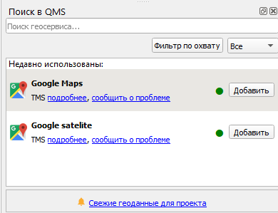

# Географическая привязка в  {#georeference}

## Чтение CSV-таблиц {#georeference-qgis}
[В начало справки ⇡](#georeference)

Для привязки данных дистанционного зондирования в QGIS можно использовать WMS-сервис с мозаикой спутниковых снимков. Для включения мозаики зайдите в меню **Модули – Управление и установка модулей...**. Впишите в строку поиска __QuickMapServices__. Установите модуль.

Откроется окно модуля. В окне поиска геосервиса введите __Google satelite__. Нажмите **Добавить**.

Добавьте в качестве слоя данных привязываемый снимок.

> Примечание: Если у вас такой панели не оказалось, это значит, что она отключена. Для включения панели щелкните правой кнопкой мыши по пустому месту на панели и найдите **панель работы со слоями**.

----
_Карпачевский А.М._ **Фотограмметрия и основы дистанционного зондирования**. М.: Географический факультет МГУ, `r lubridate::year(Sys.Date())`.
----