# Преобразования пространственного разрешения {#pansharpen}

## Создание проекта в ArcGIS Pro {#pansharpen-project}

Запустите ArcGIS Pro. В открывшемся окне выберите запуск проекта без шаблона.

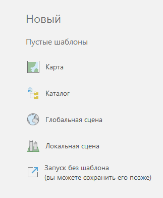

Окно программы состоит из нескольких основных панелей: слева таблица содержания, самое большое окно посередине – окно карты, справа панель каталог и инструментов геообработки. Панель каталога нужна для того чтобы обращаться к данным, расположенным на компьютере. Раскройте пункт **Folders** и найдите свою папку, либо папку, расположенную выше по древу. Если её нет, можно добавить подключение к папке, щёлкнув правой кнопкой мыши.

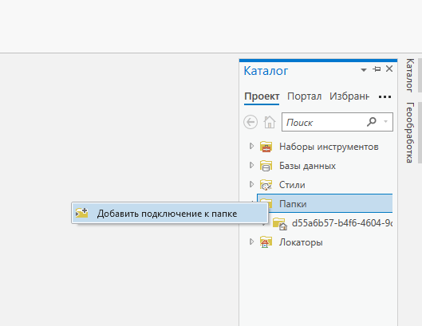

Внутри своей папки создайте новую базу геоданных, щёлкнув по ней правой кнопкой.

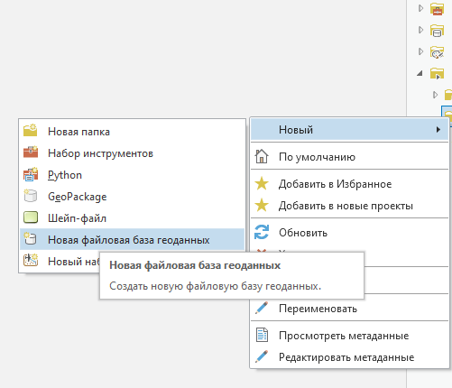

После этого база геоданных появится в перечне всех доступных баз данных в каталоге. Найдите там свою базу и сделайте её базой по умолчанию.

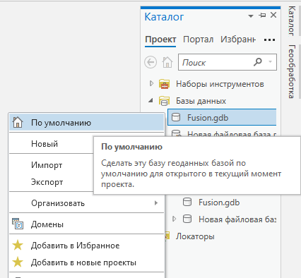

Через главное меню добавьте новую карту.

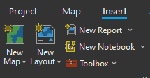

Сохраните проект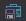 в той же директории, где расположена база данных, после чего в каталоге на этой папке должен появиться значок домика.

## Создание композита {#pansharpen-composite}

Для создания композита перетащите из окна каталога файлы отдельных каналов изображения. В панели геообработки найдите набор инструментов **Data Management Tools – Raster – Raster Processing**, внутри него выберите инструмент **Composite Band**.

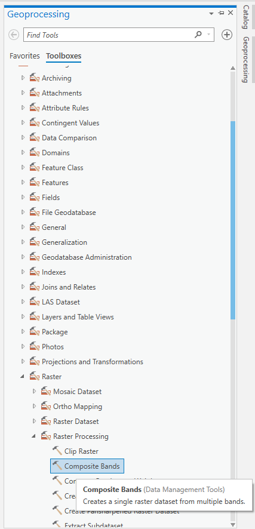

На вход инструменту подайте отдельные каналы, на выход укажите название итогового композита – обратите внимание, что он должен быть в базе геоданных по умолчанию.

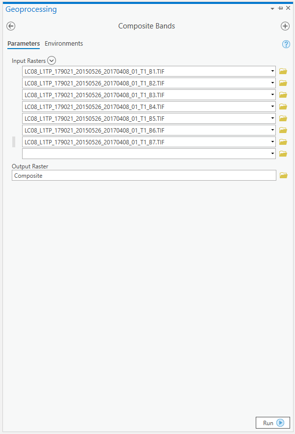

Для того чтобы задать визуализацию синтеза каналов нового композита, выделите слой и перейдите во вкладку **Appearance** основной ленты меню. В **Band Combination** укажите пользовательский синтез (**Custom**) и задайте соответствие каналов изображения каналам основных цветов.

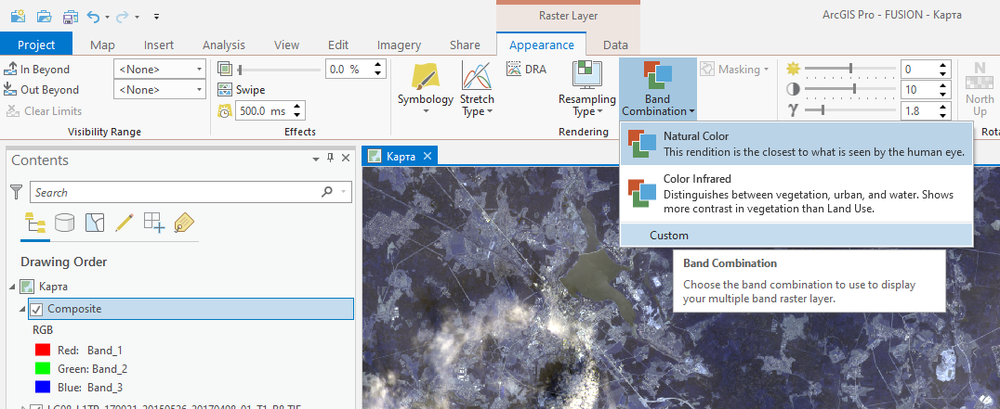

## Вырезание фрагмента изображения {#pansharpen-extract}

Для вырезания фрагмента изображения необходимо создать новый класс объектов в базе геоданных. Для этого щёлкните правой кнопкой мыши по базе **New – Feature Class**.  В открывшемся окне задайте имя и систему координат класса.

Добавьте класс объектов в окно карты и перейдите на вкладку **Edit** главного меню, выберите пункт **Create**.

Справа откроется панель с шаблонами объектов. Выберите способ создания объекта – прямоугольник. Отрисуйте прямоугольник на карте, который охватит вырезаемую область изображения.

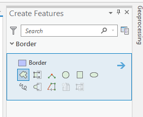

После того, как объект будет готов, сохраните изменения, нажав на кнопку .

Вырезается фрагмент изображения с помощью инструмента **Extract by Mask** – его можно найти на панели инструментов геообработки в наборе инструментов **Spatial Analyst Tools – Extraction**.

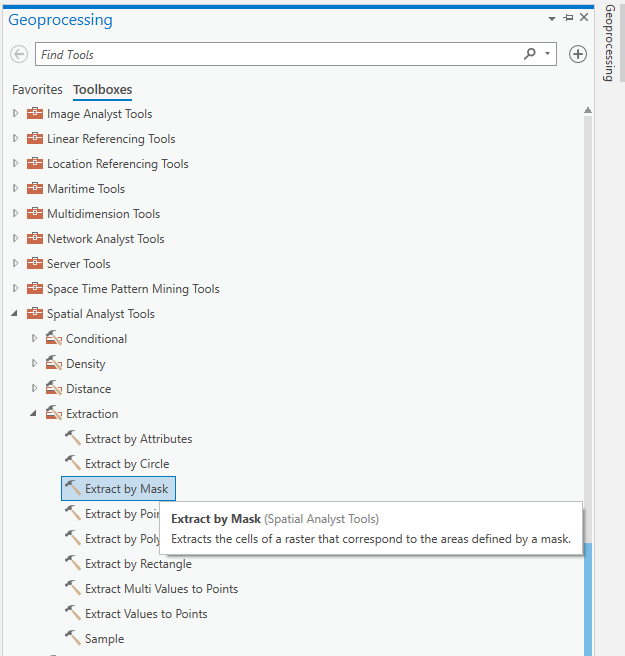

У полученного фрагмента изображения может быть не настроена гистограмма. Перейдите во вкладку **Appearance** и нажмите на кнопку **DRA** для автоматической настройки гистограммы фрагмента, либо исправьте гистограмму вручную.

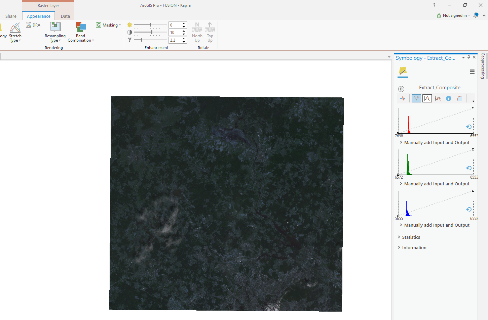

## Фильтрация {#pansharpen-filter}

Для градиентной фильтрации выберите растр, в основной ленте меню выберите вкладку **Imagery**, нажмите на кнопку **Raster Functions** – у вас справа откроется панель с различными инструментами растров, в том числе во вкладке **Appearance** есть инструмент свёртки (**Convolution**).

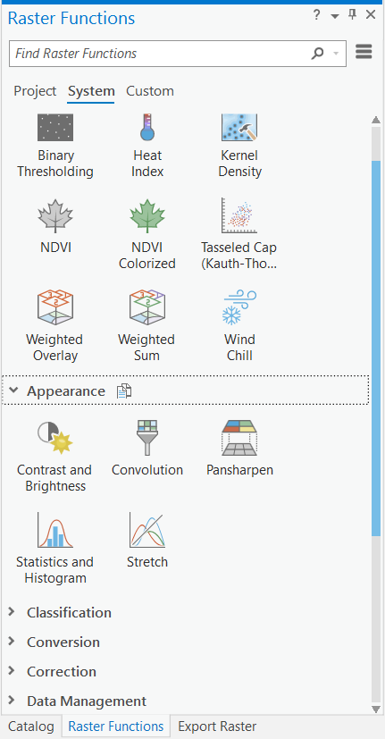

Для линейной (высокочастотная, низкочастотная) фильтрации можно использовать инструмент **Spatial Analyst Tools – Neighborhood – Filter**. В качестве входных параметров необходимо указать исходный растр, а также тип фильтрации.

## Передискретизация {#pansharpen-resampling}

Для передискретизации используется инструмент **Data Management Tools – Raster – Raster Processing – Resample**. В качестве входных параметров необходимо указать исходный растр, а также размер ячейки нового растра и тип интерполяции

## Паншарпенинг {#pansharpen-pansharpen}

Для паншарпенинга используется инструмент **Data Management Tools – Raster – Raster Processing – Create Pansharpened Raster Dataset**. В качестве входных параметров необходимо указать исходный растр, тип преобразования и некоторые другие параметры, которые зависят от типа преобразования.

## Работа в режиме компоновки {#pansharpen-layout}

Для работы с данными в ArcGIS Pro мы находимся в окне карты (**Map**). Вы можете создать несколько окон карты через меню **Insert – New Map**. Слои содержания можно скопировать в каждую карту, а также синхронизировать их визуализацию через меню **View – Link Views – Center And Scale**. Создание компоновки осуществляется через меню **Insert – New Layout**, после чего у вас откроются варианты с параметрами листа компоновки. Эти параметры, включая ориентировку листа можно поменять в свойствах, вызвав их нажатием правой кнопки мыши.

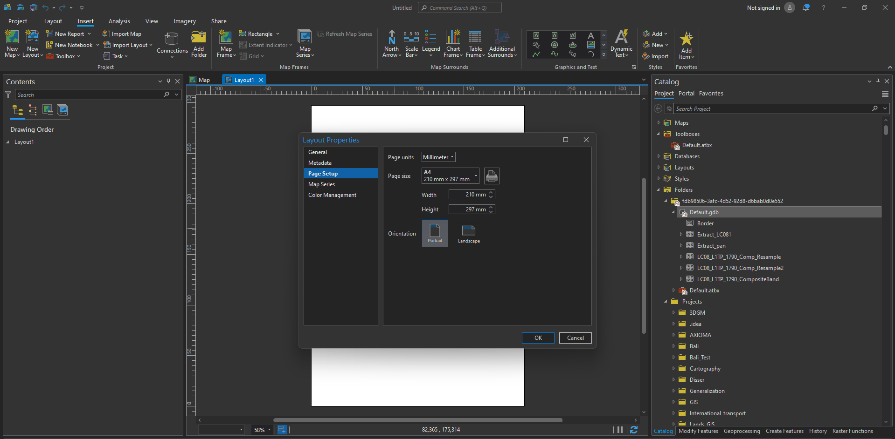

Используйте кнопку **Insert – Map Frame** для того чтобы вставить картографическое изображение в лист компоновки.На одном листе можно разместить несколько картографических изображений, последовательно используя эту кнопку. Выделенный фрейм карты будет жирным в таблице содержания и отображаться в режиме узлов на листе карты.

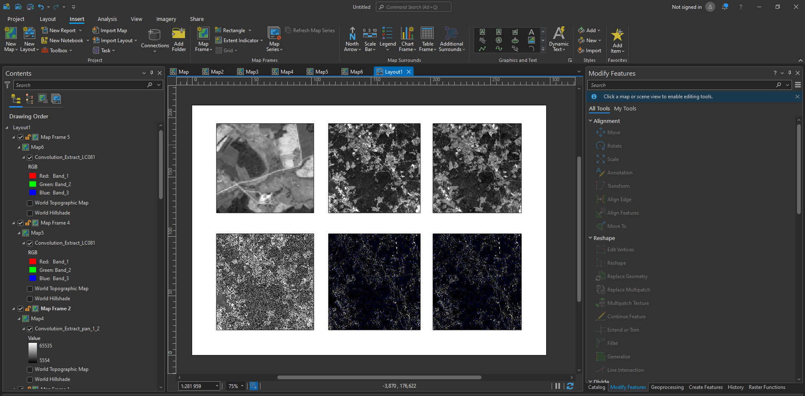

Для того чтобы область охвата фрейма переместилася к вашим данным, выберите соответствующий слой в таблице содержания и правой кнопкой вызовите меню **Zoom To Layer**.  Вы можете менять масштаб изображения внутри фрейма в соответствующем окошке внизу. Для перемещения данных в пределах окна фрейма необходимо активировать карту правой кнопкой мыши и нажав **Activate**. Затем вернитесь в меню **Map** и переключитесь в режим **Explore**. Для выхода обратно в режим компоновки нажмите **Close Activation**.

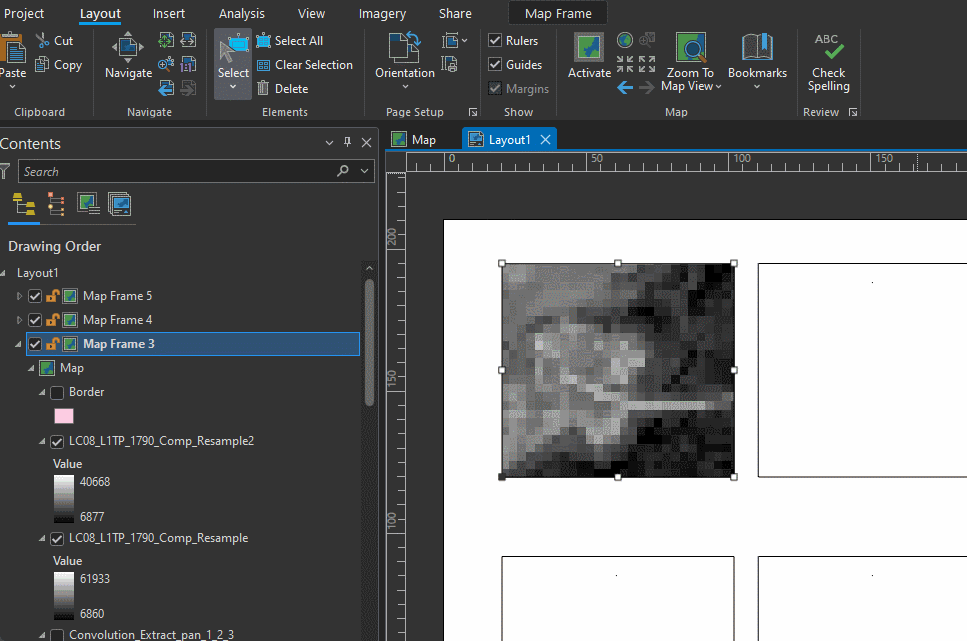

Для всех фреймов можно выставить экстент из окна карты **Layout – Zoom To Map View** или **Layout – Zoom To Last Active View**.

В окно компоновки можно вставить другие элементы: текст, графику, масштабную линейку и т.д. Правой кнопкой можно зайти в свойства элемента, поменять гарнитуру, кегль, выравнивание и прочие параметры.

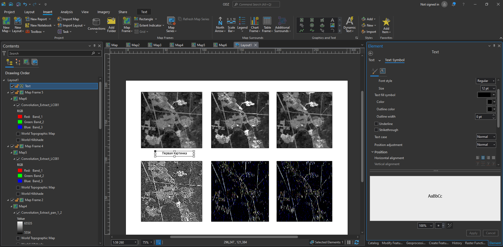

Экспорт составленного макета компоновки можно сделать через меню **Share – Export Layout** или скопировать изображение в буфер обмена **Capture To Clipboard**

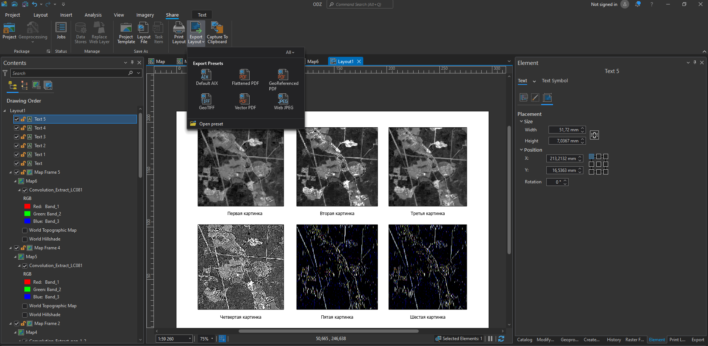

----
_Карпачевский А.М._ **Основы дистанционного зондирования и фотограмметрии**. М.: Географический факультет МГУ, `r lubridate::year(Sys.Date())`.
----