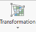
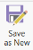
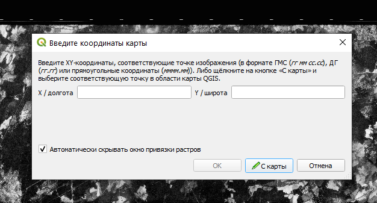
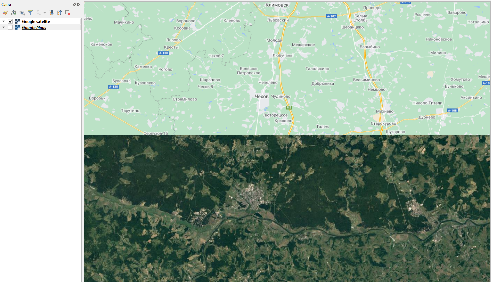

# Географическая привязка {#georeference}

## Географическая привязка в ArcGIS Pro {#georeference-arcgis}

### Привязка на основе ввода координат

Создайте новый проект и сохраните его. Задайте систему координат датафрейма (карты) – для этого зайдите в свойства **Map** и перейдите во вкладку **Coordinate Systems**, раскройте список **Projected coordinate system** и выберите нужную СК.

Добавьте из панели каталога растр, который необходимо привязать.Выделите его в списке слоев и во вкладке **Imagery** нажмите на кнопку **Georeference**.

Открытая панель привязки состоит из нескольких кнопок. Убедитесь, что у вас нажата кнопка **Auto Apply**, которая позволяет трансформировать изображение на лету.

Нажмите на кнопку **Add Control Points**  и установите опорную точку в нужном месте на карте. После этого вам будет предложено установить соответственную точку на референцном слое или ввести заданные координаты для точки – для этого щёлкните правой кнопкой мыши, после чего откроется окошко для ввода координат.

Если нажать на кнопку **Control Point Table** , то откроется таблица, где будут показаны все установленные опорные точки с их координатами в исходной и референцной системе координат. В этой же таблице указываются ошибки (невязки) общая и по отдельным координатам. Слева можно включать и выключать точки из расчёта. Когда точка выключена из расчёта, она превращается из опорной в контрольную.

Установив необходимое количество точек, вы можете нажать на кнопку **Transformation** и выбрать тип трансформации. После установки опорных точек и выбора типа трансформации можно запустить процесс трансформирования и сохранения нового изображения, нажав на кнопку .

Обратите внимание, что опорные точки можно сохранять отдельно (экспортировать) – для этого есть кнопка **Export Control Points** и импортировать **Import Control Points**.

### Привязка на основе референцного изображения

При привязке снимка к референцному изображению удобно воспользоваться кнопкой **Fit to Display** , которая переместит привязывамаемое изображение в экстент, соответствующий текущему дисплею карты.

Далее для привязки неоходимо снова нажать на кнопку **Add Control Points** и поставить сначала точку на привязываемом изображении, а затем на референцном.

## Географическая привязка в QGIS {#georeference-qgis}
[В начало справки ⇡](#georeference)

Для привязки данных дистанционного зондирования в QGIS можно использовать WMS-сервис с мозаикой спутниковых снимков. Для включения мозаики зайдите в меню **Модули – Управление и установка модулей...**. Впишите в строку поиска __QuickMapServices__. Установите модуль.

Откроется окно модуля. В окне поиска геосервиса введите __Google satelite__ или какой-либо еще картографический веб-сервис со спутниковой подложкой. Нажмите **Добавить**.

Добавьте в качестве слоя данных привязываемый снимок.

> Примечание: Если у вас такой панели не оказалось, это значит, что она отключена. Для включения панели щелкните правой кнопкой мыши по пустому месту на панели и найдите **панель работы со слоями**.

Включите **Панель инструментов работы с растровыми данными**. На ней нажмите кнопку **Привязка растров** .

Откроется окно привязки. Нажмите на кнопку **Открыть растр** , добавьте привязываемый растр. Щелчок левой кнопкой мыши по привязываемому изображению открое окно, куда будет предложено ввести координаты. Если вы для привязки хотите использовать референцное изображение, нажмите на кнопку **С карты**.

Для настройки параметров трансформации нажмите на кнопку . Опорные точки можно сохранять и подгружать – для этого используйте соответствующие кнопки на панели. Для запуска процесса трансформации нажмите на кнопку 

После добавления трансформированного изображения в основное окно карты убедитесь в правильности проделанной операции, сравнивая его с подложкой из мозаики спутниковых снимков. Для этого удобно использовать инструмент шторки.

Зайдите в **Модули – Управление и установка модулей...** и вбейте в поиск **MapSwipe Tool**. После этого появится панель шторки.

Выберите слой, который будет активен в режиме шторки (будет находиться под шторкой) и нажмите на кнопку .

----
_Карпачевский А.М._ **Основы дистанционного зондирования и фотограмметрии**. М.: Географический факультет МГУ, `r lubridate::year(Sys.Date())`.
----