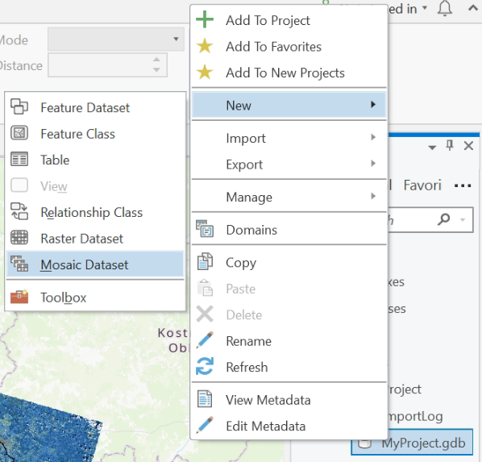
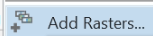
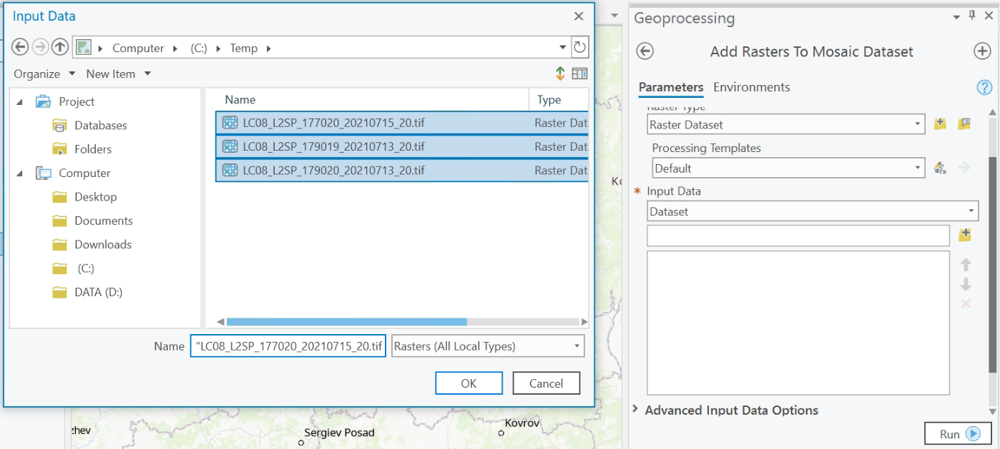

# Создание мозаики {#mosaic}

## Создание мозаики в ArcGIS Pro {#mosaic-arcgis}
[В начало справки ⇡](#mosaic)

Для создания мозаики с помощью ГИС-пакета ArcGIS Pro необходимо создать специальный набор данных мозаики внутри базы данных. Следует понимать, что этот набор данных не хранит собственно растры, а лишь ссылки на них. Для его создания нажмите правой кнопкой мыши по базе данных, выберите пункт **New – Mosaic Dataset**.

В открывшемся окне геообработки укажите параметры мозаики – название набора и проекцию. Нажмите на кнопку **Run**. В результате в таблицу содержания добавится специальный слой мозаики, который включает в себя собственно изображения, границы мозаики и границы отдельных изображений. Пока в мозаику не добавлены снимки, эти слои останутся пустыми.

Для добавления растров в мозаику правой кнопкой мыши кликните по набору и выберите . Откроется окно инструмента. Если растры находятся в одной папке, можно указать её в качестве источника данных, либо можно указать каждый растр индивидуально, выбрав категорию **Dataset** в окне **Input Data**. Обратите вимание, что в окне **Raster Type** можно выбрать соответствующую категорию из доступных съёмочных систем, а в **Processing Templates** можно выбрать тип продукта (уровень обработки).

Для настройки комбинации каналов мозаики выберите слой с изображением, выберите сверху вкладку **Appearance**, нажмите на **Band Combination**. Вы можете изменить яркость и контрастность изображения через настройку гистограммы **Stretch Type**.

----
_Карпачевский А.М._ **Основы дистанционного зондирования и фотограмметрии**. М.: Географический факультет МГУ, `r lubridate::year(Sys.Date())`.
----