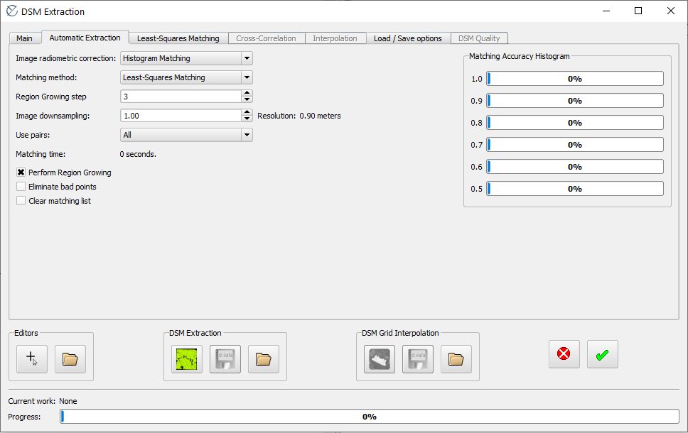
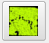
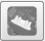
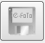
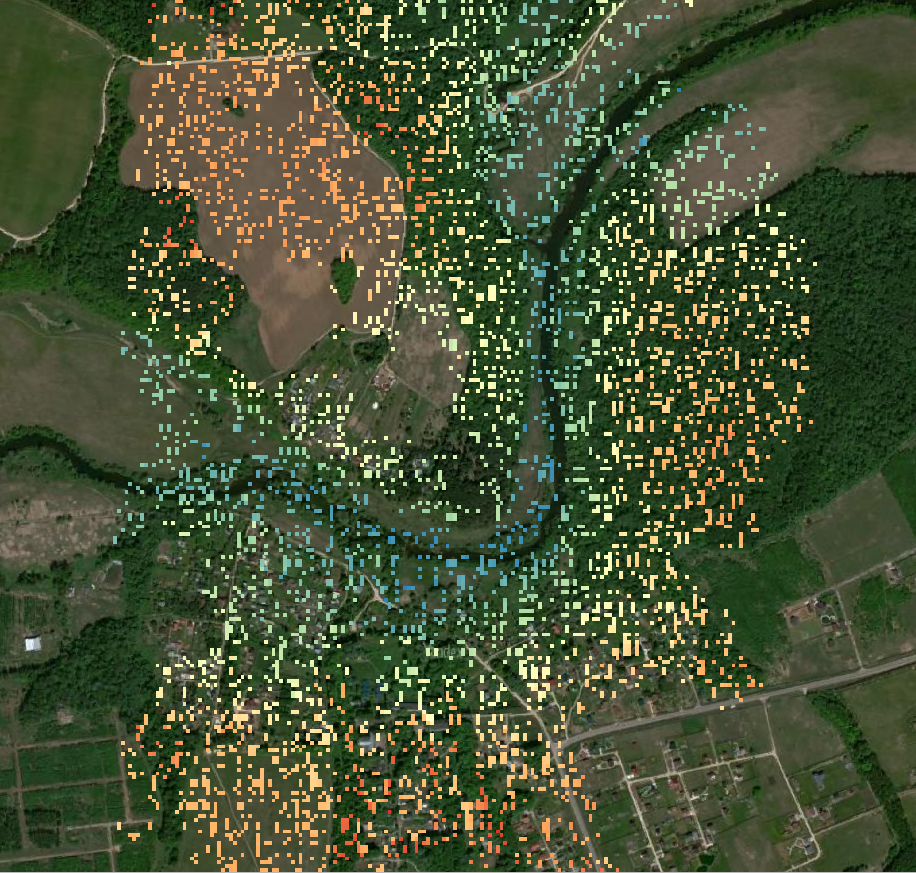
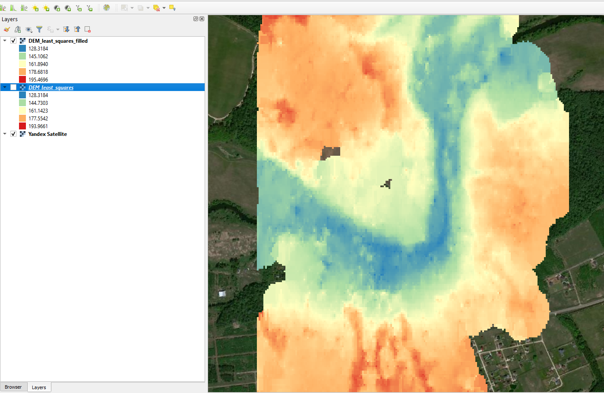
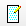
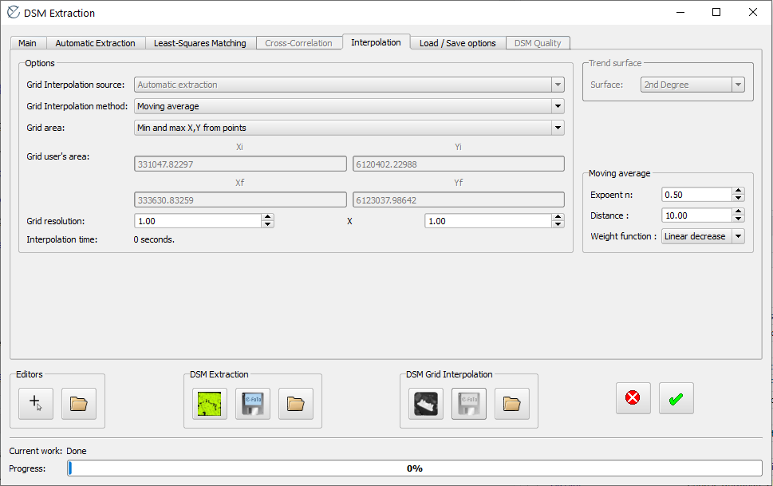
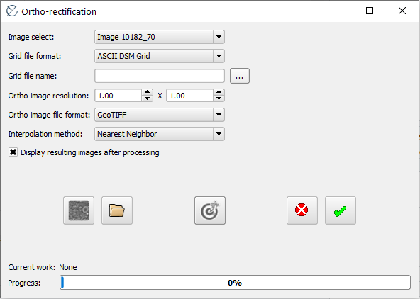
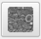

# Получение ЦММ и ортотрансформация {#dem}

## Исходные данные {#dem-initial}
[В начало справки ⇡](#dem)

В качестве исходных данных в этой работе выступают ориентированные и привязанные снимки из предыдущей модели, а также полученная на их основе стереомодель в программе E-foto.

## Построение ЦММ {#dem-create}
[В начало справки ⇡](#dem)

Выберите команду **Execute – DSM Extraction**. Откроется окно соответствующего модуля.Перейдите во вкладку **Automatic Extraction**.

Здесь можно выбрать тип радиометрической коррекции – для чёрно-белых снимков лучше всего выбрать **Histogram matching**. Для обработки стереопар и поиска тождественных точек в программе доступно два метода – кросс-корреляции (**Cross-correlation**) и наименьших квадратов (**Least-Squares Matching**). Проделайте сначала всё одним методом, затем попробуйте другой и сравните результат. Для ускорения процесса построения лучше задать параметр передискретизации (**Image downsampling**) 2 (размер пикселов уменьшиться в два раза). В окне **Use pairs** выберите ту стереопару, по которой нужно построить ЦММ. Нажмите на кнопку  для запуска процесса. По окончании процесса откроется окно для просмотра найденных пикетов в виде жёлтых крестиков.

После того, как пикеты были извлечены, необходимо их интерполировать. Для этого нажмите на соответствующую кнопку . После этого можно экспортировать полученный грид.Перейдите во вкладку **Load/Save Options**, выберите **DSM extraction file format** – облако точек без индексов, а **Grid file format** – **ASCII DSM Grid**. В разделе **DSM Grid Interpolation** внизу окна нажмите на сохранение  и сохраните текстовый файл с высотными данными.

## Работа с высотными данными в QGIS {#dem-QGIS}
[В начало справки ⇡](#dem)

Добавьте в QGIS полученные ранее высотные данные как текст с разделителями. Обратите внимание, что необходимо правильно выбрать символ разделителя, указать количество строк заголовка файла, которые мы не учитываем, указать соответствующие поля для координат, а также правильную систему координат.

Добавленные данные необходимо сохранить либо в виде шейп-файла, либо в базе геоданных, щёлкнув правой кнопкой по слою **Экспорт – сохранить как**. Для получения растровой поверхности используйте инструмент **Grid (Nearest Neighbor)...**. Его можно найти через меню **Raster – Analysis**. Укажите поле для Z-значений в настройках инструмента. После настройки символики ваша ЦММ примет примерно следующий вид – очевидно, что в ней много пропущенных данных.

Для заполнения пропусков воспользуйтесь инструментом **Raster – Analysis – Fill nodata...**. После этого ЦММ должна принять примерно следующий вид:

## Построение производных поверхностей {#dem-derived}
[В начало справки ⇡](#dem)

В QGIS доступны многие инструменты для построения производных поверхностей от ЦМР и ЦММ, например:

1) _Углы наклона_ – **Raster – Analysis – Slope...**.

2) _Экспозиция склонов_ – **Raster – Analysis – Aspect...**.

3) _Аналитическая отмывка рельефа_ – **Raster – Analysis – Hillshade...**.

Кроме того, мы можем извлечь изолинии (горизонтали) с помощью инструмента **Raster – Extraction – Contour...**.

## Верификация ЦММ по точкам стереоизмерений {#dem-verification}
[В начало справки ⇡](#dem)

Измерьте высоты с помощью стереокомпаратора в местах, где есть крупные пропуски данных в ЦММ. Полученные точки можно экспортировать в шейпфайл, нажав на кнопку . В открывшемся окне выберите формат сохранения **SHP**.

Для извлечения значений высот ЦММ в точки используйте инструмент в QGIS **Sample Raster Values**. Этот инструмент записывает в виде атрибута значения ячеек растра, в которые попадают точки. Для расчёта собственных значений высот точек шейпфайла (полученные в результате стереоизмерений) можно зайти в калькулятор поле и написать выражение для нового атрибутивного поля _ z($geometry)_.

## Ортотрансформация с использованием полученной ЦММ {#dem-orthorectification}
[В начало справки ⇡](#dem)

Для ортотрансформации снимков в **E-foto** требуется ЦММ в собственном формате, что обуславливает необходимость её коррекции (заполнения пропусков) внутренними средствами программы. Для этого в модуле **DSM Extraction** после извлечения ЦММ перейдите на вкладку **Interpolation**. В параметре **Grid Interpolation method** необходимо выбрать **Moving average** (обычно установлено по умолчанию). В параметре **Distance** укажите размер плавающего окна осреднения в пикселях, например, 10.

Сохраните ЦММ в формате **ASCII DSM Grid** и выйдите из модуля.

Запустите модуль ортотрансформации **Execute – Ortho-Rectification**.

Выберите изображение, которое необходимо ортотрансформировать, укажите формат ЦММ такой же, как вы указывали для её сохранения, укажите путь к файлу ЦММ. В качестве выходного формата для изображения укажите **GeoTIFF**. Для запуска процедуры нажмите .

Ортотрансформированное изображение скорее всего сохранится без СК, но вы сможете её задать в QGIS. для сопоставления ортотрансформированного изображения с исходным можно воспользоваться инструментом **Шторка**.

----
_Карпачевский А.М._ **Основы дистанционного зондирования и фотограмметрии**. М.: Географический факультет МГУ, `r lubridate::year(Sys.Date())`.
----