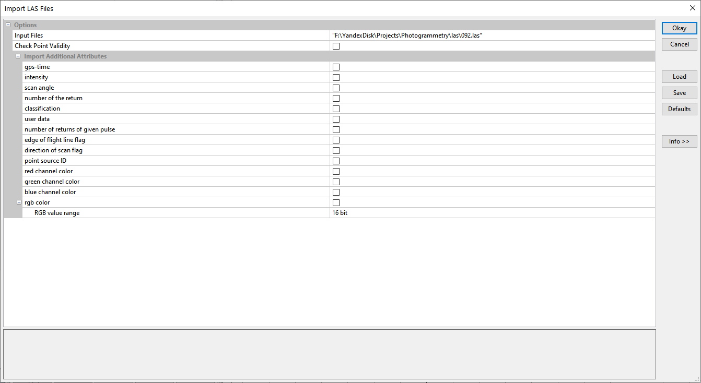

#  Лазерное сканирование {#las}

## Программное обеспечение {#las-soft}
[В начало справки ⇡](#las)

Для практической работы вам понадобится открытая программа **CloudCompare**. Информацию о ней можно найти на [домашнем сайте](https://www.danielgm.net/cc/){target="_blank"}, там же можно скачать себе дистрибутив программы. Для этого выберите **Latest stable release (2.11.3 Anoia) – Windows iconWindows 64 bits Stereo**.

Также для работы нам потребуется ГИС-пакет с открытым исходным кодом **SAGA**, который можно скачать [по ссылке](https://sourceforge.net/projects/saga-gis/files/latest/download){target="_blank"}. Программа не требует установки.

## Исходные данные {#las-initial}
[В начало справки ⇡](#las)

[Облако точек](https://yadi.sk/d/CKfoC4XVkCTuIg){target="_blank"}

[Мозаика аэрофотоснимков](https://yadi.sk/d/Vj1B8y3_BG1mMA){target="_blank"}

[Векторные полигоны](https://disk.yandex.ru/d/MruskWn_oupM0w){target="_blank"}

## Работа с облаком ТЛО в SAGA {#las-Extract}
[В начало справки ⇡](#las)

Для импорта ТЛО используйте инструмент **Tools – Import/Export – LAS – Import LAS Files**. Укажите путь к файлу, а все остальные параметры оставьте по умолчанию. Нажмите **Okay** для запуска инструмента.

Вы можете визуализировать облако, дважды щёлкнув по появившемуся слою во вкладке **Data**.

В SAGA доступен инструмент для трёхмерной визуализации облаков точек. Для этого выберите **Tools – Visualization – 3D Viewer – Point Cloud Viewer**. Координату Z можно использовать для цветовой шкалы.

Добавьте готовый векторный объект в SAGA в формате шейпфайла через меню **Open** , который потом будет использован для вырезания облака точек. В панели менеджера перейдите на вкладку **Data**. Двойной щелчок по слою предложит добавить слой к либо к уже открытой карте, либо к новой карте. На панели **Settings** вы можете настроить отображение данных, подписи объектов.

С помощью инструмента  можно выбрать и удалить ненужные объекты. Для того чтобы вырезать фрагмент облака, воспользуйтесь инструментом **Tools – Shapes – Point Clouds – Point Cloud Cutter**.  В параметре **Points** укажите загруженный слой точек, в параметре **Choose cut from...**  выберите параметр **Polygons**. После нажатия **Okay** откроется новое окно, в котором будет предложено указать непосредственный векторный слой для обрезки.

После появления вырезанного облака точек воспользуйтесь инструментом **Tools – Import/Export – LAS – Export LAS Files**. В параметре **Point Cloud** укажите набор данных для экспорта, укажите масштабный коэффициент по трём осям равным 1. Остальные параметры остаются по умолчанию.

## Работа с ТЛО в CloudCompare {#las-cloudcompare}
[В начало справки ⇡](#las)

В программе через меню **File – Open** откройте ваш фрагмент облака точек. Для того чтобы точки облака приобрели цвет (скаляр), указываем, что переменной цвета соответствует координата Z. Для этого вызываем меню **Edit – Scalar Fields - Export coordinates to SF** и выбираем координату.

Для классификации облака точек на точки земли и точки всего остального вызываем меню **Plugins – CSF Filter**. Попробуйте разные настройки инструмента, сравните результаты. В **Advanced parameters** укажите параметр **cloth resolution** = 0,5.Результат классификации добавится в виде отдельных облаков точек.

С помощью инструмента Segment  вырезаем объекты типа дорог и рек. Для этого нарисуйте полигон, ставя узлы левой кнопкой мыши. Замыкание полигона осуществляется нажатием правой кнопки мыши. После отрисовки участка, который необходимо очистить от ТЛО, выберите на панели  кнопку **Segment Out**. В результате у вас появятся новые поднаборы облаков точек в списке слоёв слева.

Для получения растровой поверхности, горизонталей и mesh-модели используется кнопка  на главной панели, либо вызывается меню **Tool – Projection – Rasterize**. В открывшемся окне укажите разрешение растра **step – 1**, ось координат для проекции **direction – Z**, размер ячейки укажите минимальный **cell height – minimum**, а также передискретизация **resample input cloud – checked**. пустые ячейки оставьте пустыми **Empty cells fill with – leave empty**.

Для запуска процесса растеризации нажмите на кнопку **Raster** и укажите путь для сохранения файла GeoTIFF. Опционально вы можете построить горизонтали **Contour plot**.

----
_Карпачевский А.М._ **Основы дистанционного зондирования и фотограмметрии**. М.: Географический факультет МГУ, `r lubridate::year(Sys.Date())`.
----