# Обработка сканерных космических изображений с помощью RPC в Agisoft Metashape {#rpc_metashape_metashape}

## Исходные данные {#rpc_metashape-initial}
[В начало справки ⇡](index.qmd)

В качестве исходных данных можно использовать выложенные в открытый доступ сканерные изображения со спутника IKONOS. Данные, включая изображения, метаданные, коэффициенты рациональных полиномов, а также наземные опорные точки, можно скачать [со страницы](https://www.isprs.org/data/ikonos_hobart/default.aspx){target="_blank"}, либо [из облака](https://disk.yandex.ru/d/xvrvx3Did67xFw){target="_blank"}.

## Подготовка данных {#rpc_metashape-prepare}
[В начало справки ⇡](index.qmd)

Откройте Agisoft Metashape и зайдите в настройки программы *Tools – Preferences...*. На вкладке *Advanced* установите галочку напротив опции **Load satellite RPC data from auxiliary TXT files**. Нажмите на кнопку **Apply** и закройте окно настроек.

Добавьте в проект файлы космических сканерных изображений. Убедитесь, что файлы изображений находятся в одной папке с метаданными и RPC. По умолчанию, файлы будут отображаться в виде чёрных изображений. Это связано с тем, что сканерные изображения часто имеют высокую динамическую область и требуют радиометрической коррекции для правильного отображения. Чтобы растянуть гистограмму и сделать изображения видимыми, нажмите на кнопку  на главной панели. В открывшемся окне нажмите на кнопку **Estimate**, после чего нажмите на кнопку **Apply**. В результате изображения должны отобразиться корректно.

Убедиться в том, что загруженные изображения описываются метаданными и RPC, можно через меню **Tools – Camera Calibration**. В открывшемся окне в **Camera type** должно быть указано **RPC**.

Запустите процесс ректификации стереопары (**Workflow – Align Photos...**).

## Расстановка опорных точек {#rpc_metashape-gcp}
[В начало справки ⇡](index.qmd)

Откройте вкладку **Reference**. Импортируйте опорные точки из файла **Selected_HobartGCPs114-UTM.csv**. Вы работаете с данными на территорию города Хобарт, Австралия. Координаты опорных точек записаны в координатной системе отсчёта UTM 55S.

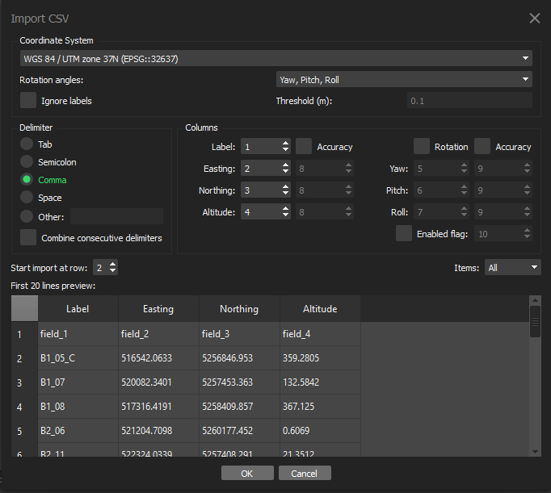

Укажите соответствующие системы координат в настройках — они будут разные для проекта, данных и опорных точек. Расставьте опорные точки на обоих сценах стереопары.

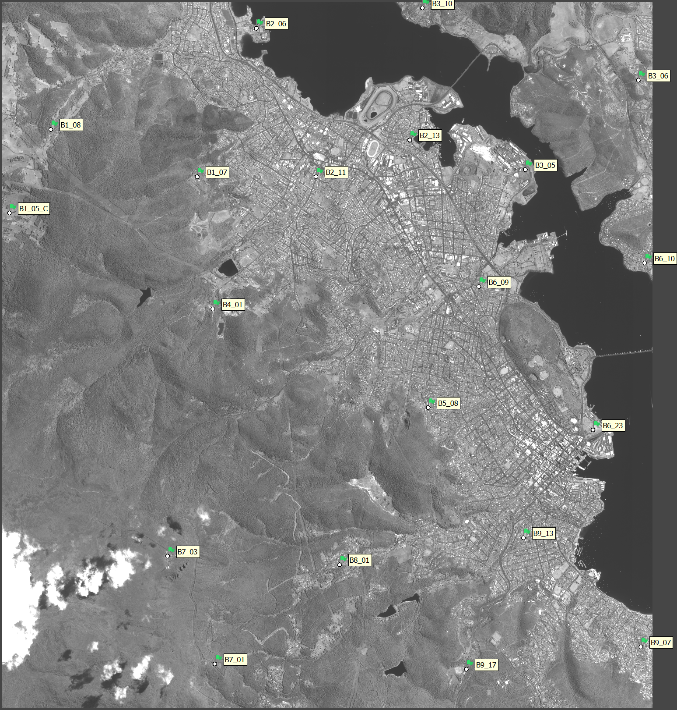

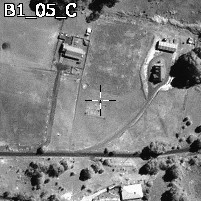

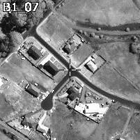

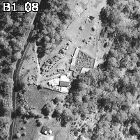

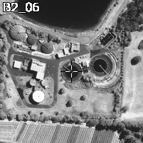

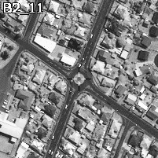

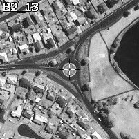

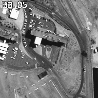

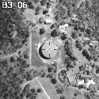

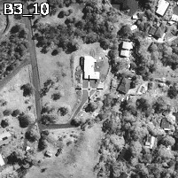

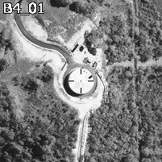

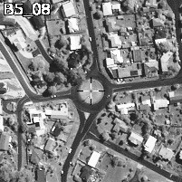

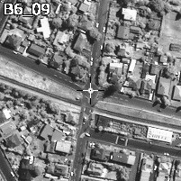

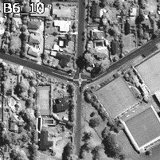

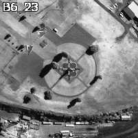

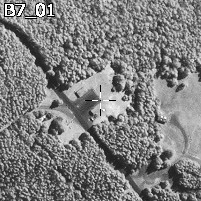

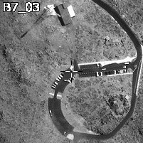

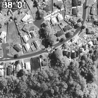

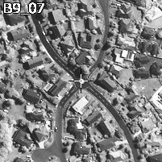

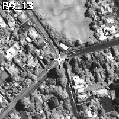

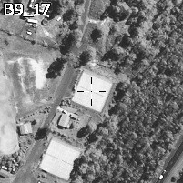

## Построение плотного облака точек и получение итоговых продуктов {#rpc_metashape-Dense_Point_Cloud}
[В начало справки ⇡](index.qmd)

Запустите процесс построения плотного облака точек (**Workflow – Build Point Cloud...**).

Запустите процесс построения цифровой модели поверхности (**Workflow – Build DEM...**) и ортофотоплана (**Workflow – Build Orthomosaic...**).
